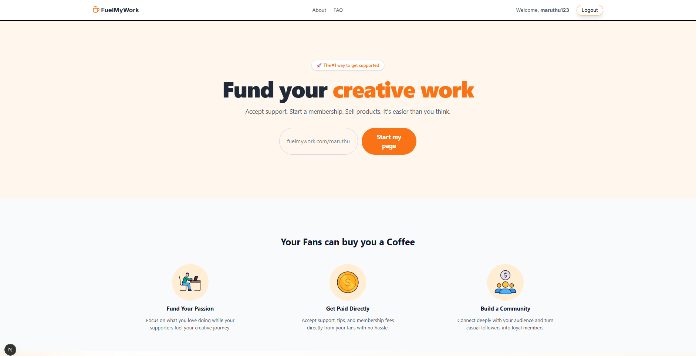

# ⛽ FuelMyWork - Get Support for Your Creative Journey


FuelMyWork is a crowdfunding platform designed for creators, developers, and influencers. It allows fans to support their favorite creators by "buying them a chai" (making small payments) directly through Razorpay.

**[🚀 View Live Demo](https://fuel-my-work-flax.vercel.app/)** · **[🐛 Report Bug](https://github.com/maruthu04/fuel-my-work/issues)**

---

## 🌟 Key Features

* **🔐 Secure Authentication:**
    * Social Login (Google & GitHub) via **NextAuth.js**.
    * Custom Credential Login (Email/Password) with secure hashing using `bcryptjs`.
* **💳 Payment Integration:**
    * Seamless payments using **Razorpay**.
    * Real-time payment status updates.
* **🎨 Dynamic User Profiles:**
    * Personalized pages for every creator (e.g., `fuelmywork.com/username`).
    * Customizable cover photos and profile pictures.
* **📊 Interactive Dashboard:**
    * Track earnings and supporters.
    * Update payment credentials securely.
* **⚡ High Performance:**
    * Built on **Next.js 14** (App Router) for server-side rendering and speed.
    * Responsive design with **Tailwind CSS**.

---

## 🛠️ Tech Stack

**Frontend:**
* [Next.js 14](https://nextjs.org/) (React Framework)
* [Tailwind CSS](https://tailwindcss.com/) (Styling)

**Backend:**
* [Next.js API Routes](https://nextjs.org/docs/api-routes/introduction) (Serverless Functions)
* [MongoDB](https://www.mongodb.com/) (Database)
* [Mongoose](https://mongoosejs.com/) (ODM)
* [NextAuth.js](https://next-auth.js.org/) (Authentication)

**Payments:**
* [Razorpay](https://razorpay.com/)

---

## 🚀 Getting Started

Follow these steps to run the project locally.

### Prerequisites
* Node.js (v18 or higher)
* MongoDB Atlas Account or Compass
* Razorpay Test Account (for keys)
* Google/GitHub OAuth Credentials

### Installation

1.  **Clone the repository**
    ```bash
    git clone [https://github.com/maruthu04/fuel-my-work.git](https://github.com/maruthu04/fuel-my-work.git)
    cd fuelmywork
    ```

2.  **Install dependencies**
    ```bash
    npm install
    ```

3.  **Configure Environment Variables**
    Create a `.env` file in the root directory and add the following:

    ```env
    # Database
    MONGODB_URI=your_mongodb_connection_string

    # NextAuth
    NEXTAUTH_URL=http://localhost:3000
    NEXTAUTH_SECRET=generate_a_random_secret_here

    # OAuth Providers
    GITHUB_ID=your_github_client_id
    GITHUB_SECRET=your_github_client_secret
    GOOGLE_ID=your_google_client_id
    GOOGLE_SECRET=your_google_client_secret

    # Payments
    NEXT_PUBLIC_RAZORPAY_KEY=your_razorpay_key_id
    RAZORPAY_SECRET=your_razorpay_key_secret
    ```

4.  **Run the application**
    ```bash
    npm run dev
    ```

    Open [http://localhost:3000](http://localhost:3000) with your browser to see the result.

---

## 📸 Screenshots

| Landing Page | User Dashboard |
|:---:|:---:|
|  |  |


---

## 🤝 Contributing

Contributions are what make the open source community such an amazing place to learn, inspire, and create. Any contributions you make are **greatly appreciated**.

1.  Fork the Project
2.  Create your Feature Branch (`git checkout -b feature/AmazingFeature`)
3.  Commit your Changes (`git commit -m 'Add some AmazingFeature'`)
4.  Push to the Branch (`git push origin feature/AmazingFeature`)
5.  Open a Pull Request

---

## 📜 License

Distributed under the MIT License. See `LICENSE` for more information.

---


Project Link: [https://github.com/maruthu04/fuel-my-work](https://github.com/maruthu04/fuel-my-work)
